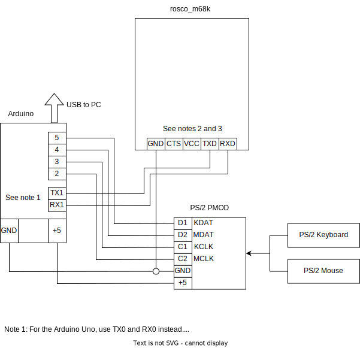

# Arduino-based IO Interface for the rosco_m68k 

This is an Arduino-based keyboard and mouse interface for the rosco_m68k. It uses the serial port to transmit the data to the rosco_m68k board. A serial echo is also possible for compatibility with rosco_m68k 1.2.

## Requirements
- rosco_m68k 1.2 or 2.0
- Arduino Uno (*) or Mega
- Digilent PS/2 PMOD (or something similar)

(*) Serial echo not available with the Arduino Uno

## Connections

## Getting Started

- Open `rosco_m68k_io.ino` with the Arduino IDE.
- Edit your configuration in `config.h`. Note that with the Arduino Uno, the serial echo feature required with a rosco_m68k 1.2 is *NOT* available. You can disable this echo feature and connect to the secondary serial port with a rosco_m68k 2.0.
- Program the Arduino

## Usage Example

A paint program for the rosco_m68k is available here https://github.com/danodus/XoseraLab/tree/main/paint.
The cursor can be moved with the mouse and the arrow keys.

## Serial Protocol

Currently, the serial data stream is only from the Arduino to the rosco_m68k.

### Keyboard

| Byte 0 | Byte 1   |
| ------ | -------- |
| 'K'    | scancode |

### Mouse

| Byte 0 | Byte 1   | Byte 2  | Byte 3 |
| ------ | -------- | ------- | ------ |
| 'M'    | mstat    | mx      | my     |

Notes:
- mx, my: horizontal and vertical mouse motion values (signed)
- mstat[2]: middle button
- mstat[1]: right button
- mstat[0]: left button
